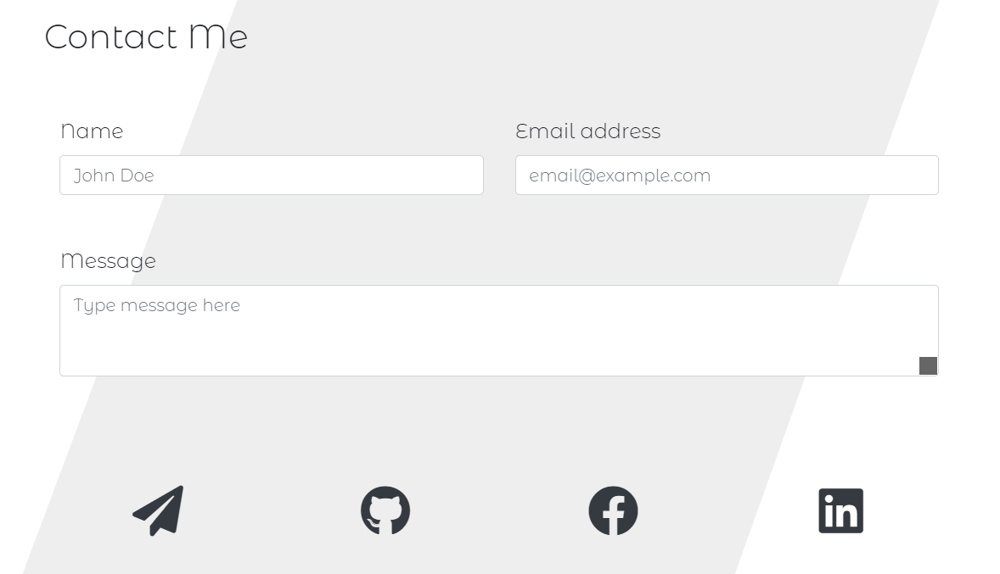

# Project: Portfolio Update

  Deployed Site Link - > https://reindeercode.github.io/Portfolio/

## Table of Contents: 
- [Project: Portfolio Update](#project-portfolio-update)
  - [Table of Contents:](#table-of-contents)
  - [License:](#license)
  - [Description:](#description)
  - [Installation Instructions:](#installation-instructions)
  - [Test Command:](#test-command)
  - [Github:](#github)
  - [My Email Address:](#my-email-address)
  - [Other Contributors:](#other-contributors)
  - [Images:](#images)

## License:

## Description:
Portfolio now includes icons, programming languages, minimalist color scheme and layout.

## Installation Instructions: 
N/A

## Test Command: 
To test type n/a into the terminal

## Github: 
Check out more projects on my Github at https://github.com/ReindeerCode

## My Email Address:
If you have any questions please feel free to email me at ReindeerCode@gmail.com

## Other Contributors:
None at this time

## Images:
Following screen shot is of the Home section

Following screen shot is of the Portfolio section

Following screen shot is of the Projects section

The following screen shot is of the YouTube section

The following screen shot is of the Contact Me section

